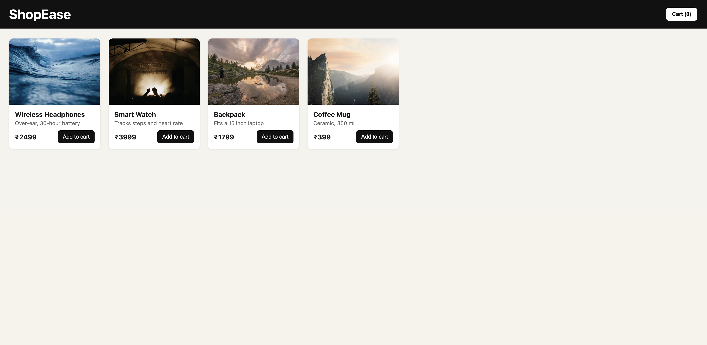
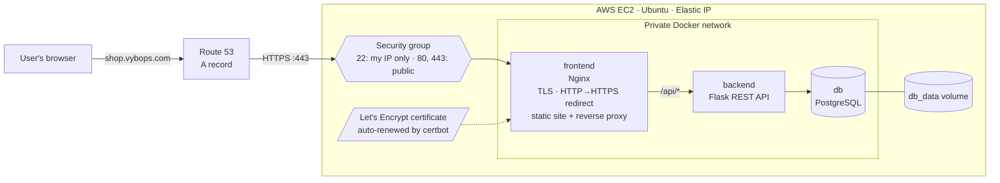

# 🛍️ ShopEase: 3-Tier Ecommerce App on AWS EC2 with Docker

A small online shop (browse products → add to cart → place order) built as **three Docker containers** and deployed on an **AWS EC2** instance with **Docker Compose**, served over **HTTPS** on a custom domain.

🌐 **Live demo:** https://shop.vybops.com

I built this project step by step to learn how real web applications are containerized, connected and deployed to the cloud.



---

## 🏗️ Architecture



| Service | Tech | Role | Exposed? |
|---|---|---|---|
| **frontend** | Nginx | Terminates TLS, redirects HTTP→HTTPS, serves HTML/CSS/JS and forwards `/api/*` to the backend (reverse proxy) | ✅ Ports 80, 443 |
| **backend** | Python · Flask | REST API: lists products, places orders | ❌ Private network only |
| **db** | PostgreSQL 16 | Stores products, orders and order items | ❌ Private network only |

Only **ports 80 and 443** are open to the internet. The API and database are reachable only inside Docker's private network.

---

## ✨ Features

- Product catalogue loaded from PostgreSQL
- Cart with live total
- Order placement: **prices are looked up on the server**, never trusted from the browser
- Parameterized SQL queries (protection against SQL injection)
- Persistent data with a **Docker volume**: orders survive container restarts
- **Healthcheck**: the backend waits until the database is ready (`depends_on: service_healthy`)
- Auto-restart of crashed containers (`restart: unless-stopped`)
- Credentials kept in a `.env` file that is **excluded from Git**
- **HTTPS** with a free Let's Encrypt certificate, HTTP→HTTPS redirect and **automated renewal**
- Custom domain with **Route 53** pointing to an **Elastic IP**
- Separate **production config** (`docker-compose.prod.yml`) so local development needs no certificate

---

## 🔌 API endpoints

| Method | Endpoint | Description |
|---|---|---|
| `GET` | `/api/health` | Health check |
| `GET` | `/api/products` | List all products |
| `POST` | `/api/orders` | Place an order |
| `GET` | `/api/orders` | List recent orders |

Example order:
```bash
curl -X POST http://localhost/api/orders \
  -H "Content-Type: application/json" \
  -d '{"customer_name": "Aseel", "items": [{"product_id": 1, "quantity": 2}]}'
```

---

## 🗄️ Database design

```
products (id, name, description, price, image_url)
orders (id, customer_name, total, created_at)
order_items (id, order_id → orders.id, product_id → products.id, quantity, price)
```

`order_items` links orders and products (many-to-many) and stores the price **at the time of purchase**, so old orders stay correct if prices change.

---

## 📁 Project structure

```
ShopEase/
├── docker-compose.yml       # all 3 services, volume, healthcheck
├── docker-compose.prod.yml  # production only: HTTPS port + certificates
├── .env.example           # settings template (real .env is git-ignored)
├── db/
│   └── init.sql           # tables + sample products (runs on first start)
├── backend/
│   ├── app.py             # Flask API
│   ├── requirements.txt
│   └── Dockerfile
└── frontend/
    ├── index.html
    ├── style.css
    ├── app.js             # calls the API with fetch()
    ├── nginx.conf         # local: static files + /api reverse proxy
    ├── nginx-https.conf   # production: TLS + HTTP→HTTPS redirect
    └── Dockerfile
```

---

## 🚀 Run it locally

Requires Docker Desktop.

```bash
git clone https://github.com/aseelibnashraf/ShopEase.git
cd ShopEase
cp .env.example .env        # then set your own password in .env
docker compose up -d --build
```

Open **http://localhost**

Useful commands:
```bash
docker compose ps              # status of all services
docker compose logs -f backend # follow backend logs
docker compose down            # stop (data is kept in the volume)
```

---

## ☁️ Deploy to AWS EC2 (with domain + HTTPS)

### 1. Server
1. **Launch an EC2 instance**: Ubuntu Server LTS, free-tier instance type, 20 GB storage
2. **Attach an Elastic IP**, so the address never changes
3. **Security group inbound rules:**

   | Type | Port | Source |
   |---|---|---|
   | SSH | 22 | My IP only |
   | HTTP | 80 | 0.0.0.0/0 |
   | HTTPS | 443 | 0.0.0.0/0 |

4. **Install Docker:**
   ```bash
   ssh -i ~/.ssh/<key>.pem ubuntu@<ELASTIC-IP>
   curl -fsSL https://get.docker.com | sudo sh
   sudo usermod -aG docker ubuntu     # then log out and back in
   ```

### 2. Domain (Route 53)
Create an **A record**: `shop.<your-domain>` → `<ELASTIC-IP>`, TTL 300.

### 3. App
```bash
git clone https://github.com/aseelibnashraf/ShopEase.git
cd ShopEase
cp .env.example .env && nano .env  # set a strong password
docker compose up -d --build
```

### 4. HTTPS certificate (Let's Encrypt)
```bash
sudo apt install -y certbot
docker compose stop frontend       # free port 80 for the domain check
sudo certbot certonly --standalone -d shop.<your-domain> -m <email> --agree-tos --no-eff-email
```
Update `server_name` and the certificate paths in `frontend/nginx-https.conf` if you use a different domain.

### 5. Start in production mode
```bash
docker compose -f docker-compose.yml -f docker-compose.prod.yml up -d
```

### 6. Automatic certificate renewal
Certbot needs port 80 free to renew, so hooks stop and start the frontend around each renewal:
```bash
sudo certbot reconfigure --cert-name shop.<your-domain> \
  --pre-hook  "docker compose -f /home/ubuntu/ShopEase/docker-compose.yml -f /home/ubuntu/ShopEase/docker-compose.prod.yml stop frontend" \
  --post-hook "docker compose -f /home/ubuntu/ShopEase/docker-compose.yml -f /home/ubuntu/ShopEase/docker-compose.prod.yml start frontend"
sudo certbot renew --dry-run       # test it
```
The `certbot.timer` systemd timer then checks for renewal automatically.

---

## 🧠 What I learned

- **Docker:** writing Dockerfiles, image layers, the difference between images and containers, port mapping, user-defined networks and volumes
- **Docker Compose:** multi-container apps, service-name DNS, healthchecks and start-up order
- **Nginx:** serving static files and acting as a reverse proxy
- **AWS:** EC2, security groups, SSH key pairs, Elastic IPs, regions, and IAM least privilege
- **DNS & TLS:** Route 53 A records, Let's Encrypt certificates, HTTP→HTTPS redirects, and automated renewal with certbot hooks
- **Environments:** keeping development and production config separate with a Compose override file
- **Security basics:** keeping secrets out of Git, exposing only what's needed, server-side validation
- **Troubleshooting:** Docker daemon not running, case-sensitive file names (`Dockerfile`), shell differences (zsh comments), apt locks during boot-time updates, SSH timeouts, and reading stderr correctly

---

## 🗺️ Roadmap

- [x] Containerized 3-tier app deployed on **AWS EC2**
- [x] Custom domain with **Route 53** + HTTPS (Let's Encrypt)
- [ ] CI/CD with **GitHub Actions**: auto-deploy to EC2 on every push
- [ ] Push images to **Amazon ECR**
- [ ] Move the database to **Amazon RDS**
- [ ] Provision the infrastructure with **Terraform**

---

## 👤 Author

**Mohamed Aseel**, aspiring DevOps Engineer
[LinkedIn](https://www.linkedin.com/in/mohamedaseelai/) · [GitHub](https://github.com/aseelibnashraf)
